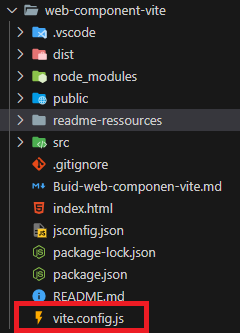
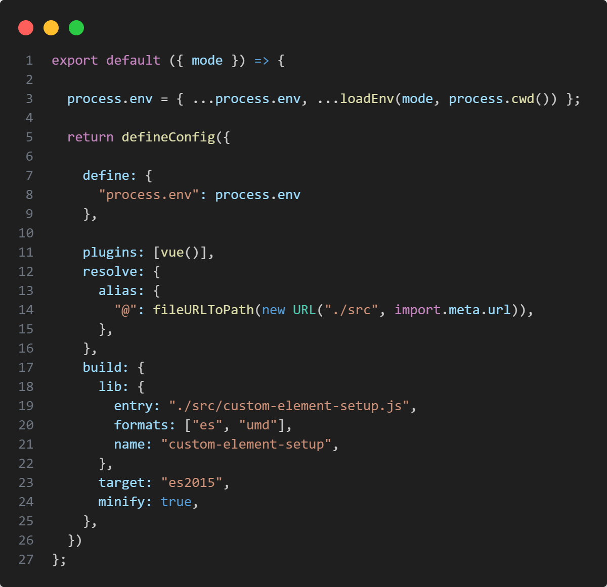
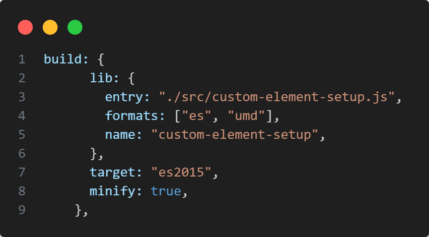
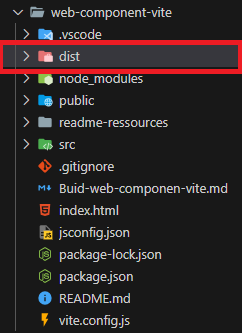
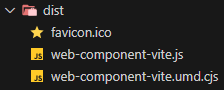
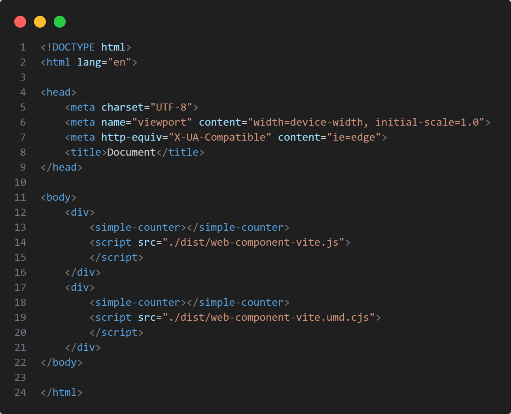
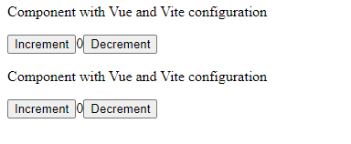

## Mise en place du build d'un composant web avec Vue3 + vite

La mise en place du buid d'un composant web ayant vite par défaut se fait différement qu'avec les projets ayant vue-cli comme base, la configuration diffère de webpack. 
A l'heure où ce document est écrit, Vue3 intègre vite.js par défaut lors de la création d'un projet, du moins dans la documentation officielle "Quick Start". Il est donc important de faire cette distinction entre les projets avec vite ou sans vite. 

Source: https://vuejs.org/guide/quick-start.html

### Préparation

Avant de s'attaquer au fichier de configuration de vite, il est recommandé d'apporter quelques modifications au package.json du projet car dans cet exemple, notre composant web sera importé sous la forme d'une librairie: 


Sans rentrer dans les détails, les options ajoutées définissent la manière dont les fichiers peuvent être importés dans les projets utilisant la bibliothèque qui sera créée plus tard.

Source: https://vitejs.dev/guide/build.html#library-mode


Le build se crée à partir du fichier de configuration vite.config.js, fichier se trouvant à la racine du projet: 



Voici le contenu du fichier de configuration qui a été modifié pour correspondre au build attendu:  



### Options du build donné en exemple

Dans ce cas précis nous allons plus nous intéresser à la section "build" du fichier de configuration car cette section détermine les options à appliquer lors de l'exécution du build de l'application.

**Note:** A retenir que Vue.js sera inclus par défaut dans le build si rien ne le précise comme dépendance externe. Dans ce cas précis, on ne s'attend pas à ce que Vue.js soit implémenté là où le composant web sera utilisé, on le laisse donc inclus dans notre build.

Vous trouverez plus de précision dans cet article: https://vuejs.org/guide/extras/web-components#tips-for-a-vue-custom-elements-library

Pour plus d'informations sur les options de configuration du build jetez un oeil à la documentation officielle de vite à ce sujet: 

https://vitejs.dev/config/build-options.html

On donnera cependant un peu plus d'explications concernant les informations ci-dessous



### Options de configuration: 

**build:** 

Section déterminant toutes les options à appliquer lors du build de l'application

&nbsp; **outDir:**
&nbsp; Détermine le nom du dossier qui contiendra tous éléments créés lors du build

&nbsp; source: https://vitejs.dev/config/build-options.html#build-outdir

&ensp; **lib:**

&ensp; Option permettant d'adapter les résultats du build de manière à ce qu'il soit réutilisable par d'autres projets (soit le but principal d'une librairie, d'où aussi le mon choix de l'avoir implémenté ainsi)

&ensp; sources:
&ensp; https://vitejs.dev/config/build-options.html#build-lib
&ensp; https://vitejs.dev/guide/build.html#library-mode

&emsp; **entry:**

&emsp; Détermine le point d'entrée du build, Vite commencera à rassembler tous les éléments du build en passant par le fichier donné dans l'option en premier

&emsp; **name:**

&emsp; Le nom donné à la librairie

&emsp; **formats:**

&emsp; Cette option affecte la manière dont la bibliothèque est exposée et la façon dont elle peut être importée par d'autres modules.

&emsp; Petite explication sur les formats choisis: 

&emsp; **ES (ECMAScript):** Adapte la librarie pour qu'elle soit conforme au derniers stardards ECMAScript. Ce format est plus adapté par les navigateurs internet modernes dont les dernières versions sont pour la plupart nativement compatibles avec les modules. Non adpaté pour les navigateurs plus anciens

&emsp; **UMD (UNIVERSAL MODULE DEfINITION)** Permet aux modules de fonctionner sur différents environnements, rend la librarie utilisable du côté client comme du côté serveur 

&emsp; **target** 

&emsp; Cette option indique quelle version Javascript doit être utilisée lors du build le code sera ainsi transpilé pour correspondre à la version indiquée. es2015 est la plus ancienne version qu'il est possible de mettre (source: https://vitejs.dev/guide/build.html#browser-compatibility)

&emsp; **minify**

&emsp; Applique la minification du code Javascript lors du build lorsque cette option est active.

&emsp; source: https://vitejs.dev/config/build-options#build-minify

### Création du build 

Une fois toutes les options mises en place, il suffira de lancer la commande 

```
npm run build
```

Ce dossier devrait apparaître à la racine du projet: 



Il contiendra les fichiers javascript générés à partir de notre build



### Test du composant web à partir du build:

Dance cas, il suffit simplement de créer un dossier à part avec un simple fichier html et de copier/coller le build généré dans le dossier. 

exemple: 


Et voici la manière dont le composant web doit être testé, dans cet exemple, on teste les différents formats (umd, es) afin de vérifier que le composant web s'applique bien





Le test sur une page web, devrait ressembler à ça, si vous avez vs code, il est possible de le tester facilement avec l'extension Live Server: 



Sources: 

https://vuejs.org/guide/best-practices/production-deployment.html

https://vitejs.dev/guide/build.html#building-for-production

https://vitejs.dev/guide/build.html#library-mode

https://vitejs.dev/config/

https://vitejs.dev/config/build-options

https://rollupjs.org/configuration-options/


Rappels: 

Modules:

https://developer.mozilla.org/en-US/docs/Web/JavaScript/Guide/Modules#browser_compatibility

https://medium.com/@halilatilla/differences-between-javascript-modules-cjs-amd-umd-and-esm-f60124de131b