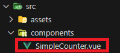

## Mise en place d'un composant web avec Vue3

La création d'un composant web avec Vue.js se fait assez simplement, du moins dans cet exemple car il s'agit d'un compteur très simple. 

La première chose à faire après la mise en place du projet est de simplement créer un composant vue. SimpleCounter.vue dans notre cas

Exemple du compteur:
 

### Transformation en élément personnalisé

La prochaine étape est d'indiquer à Vue que l'on souhaite en faire un élément personnalisé (en gros notre composant web). 

Dans cet exemple, un fichier javascript nommé custom-element-setup.js a été créé à part pour n'imclure que le code en rapporta avec la mise en place de l'élément personnalisé
Ce fichier est placé dans le dossier src du projet:

Le code permettant de faire de notre composant Vue un composant web: 

### Test du composant web

Afin de vérifier si le composant web marche comme attendu, il est nécessaire de le tester, le test se fera dans le fichier index.html à la racine du projet: 

C'est là que prend toute l'importance de l'implementation de notre composant web un peu plus tôt, le nom donné à notre élément personnalisé s'implémente comme une simple balise html

Sources: 

Composants Web:

https://developer.mozilla.org/en-US/docs/Web/API/Web_components

Composants web avec Vue.js

https://vuejs.org/guide/extras/web-components